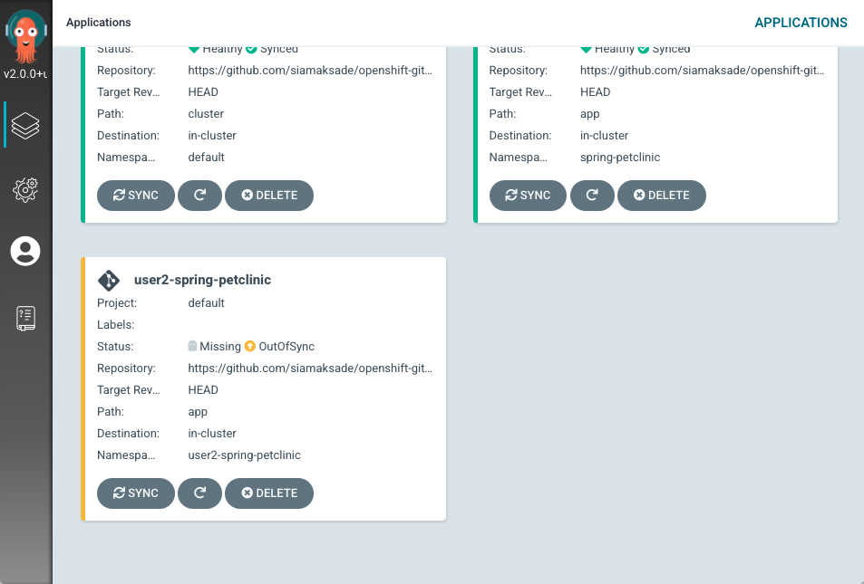
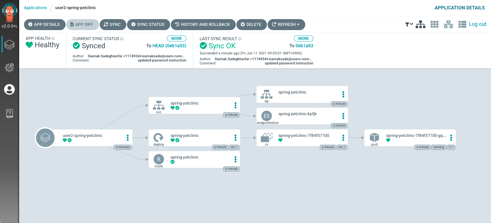
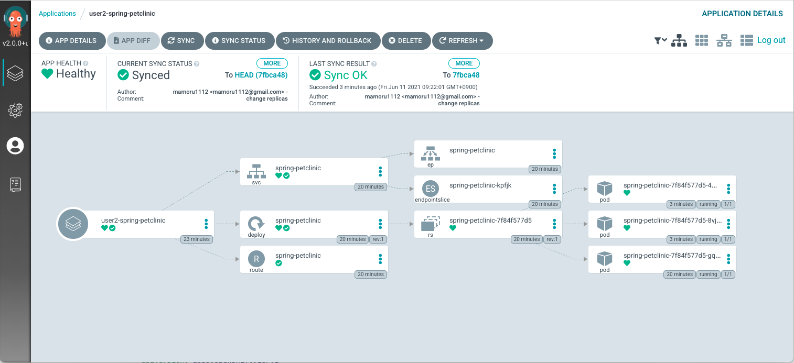
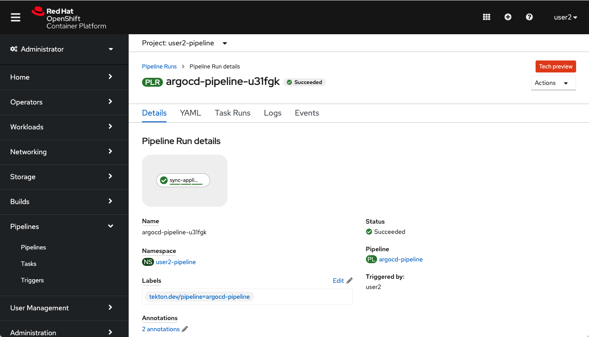

# OpenShift GitOps ハンズオン

本リポジトリは、OpenShift GitOps (Argo CD) のハンズオン資料と、ハンズオンにおいて利用するマニフェストを格納しています。


## 前提条件
* OpenShift 4.7 がインストールされていること
* OperatorHub から "Red Hat OpenShift GitOps Operator" がインストールされていること
* OperatorHub から "Red Hat OpenShift Pipelines Operator" がインストールされていること 
* 自身の Git リポジトリに本リポジトリをフォークしていること


## ハンズオン1
ハンズオン1では、Argo CD の基本的な動作のハンズオンを実施します。


### Argo CD ログイン
OpenShift GitOps Operator をインストールすると、`openshift-gitops` プロジェクトに Argo CD がインストールされます。
Argo CD へアクセスする URL と、admin ユーザでログインするためのパスワードは、以下のコマンドで確認することができます。
```
oc get route openshift-gitops-server -o jsonpath='{.spec.host}' -n openshift-gitops
oc extract secret/openshift-gitops-cluster --to=- -n openshift-gitops
```

Web ブラウザから取得した URL をアクセスし、ユーザ名に `admin` と上記のコマンドで取得したパスワードを入力し、Argo CD にログインしてください。以下の画面が表示されればログイン成功です。


### Argo CD を用いたアプリケーションのデプロイ
次に Argo CD を用いて、Git リポジトリに格納されたマニフェストを OpenShift 上にデプロイします。
Git リポジトリの app ディレクトリには、サンプルの Spring PetClinic アプリケーションをデプロイするための Kustomize を使用する Kubernetes アプリケーションが格納されています。

次のステップに進む前に Git リポジトリの app ディレクトリ配下を確認し、どのようなマニフェストを OpenShift 上にデプロイしようとしているか確認してください。
```
app/
├── deployment.yaml
├── kustomization.yaml
├── route.yaml
└── service.yaml
```


#### Project 作成
Argo CD がアプリケーションをデプロイする対象の Project を作成します。(userX は割り当てられたユーザに適宜読み替えてください)
```
oc new-project userX-spring-petclinic
```


#### Argo CD へのデプロイ権限の付与
Argo CD は、Git リポジトリの変更を監視し、Git リポジトリに格納されたマニフェストを用いてアプリケーションをデプロイします。
Argo CD の Service Account (`openshift-gitops-argocd-application-controller`) 対して、対象の Project に対する edit 権限がないとアプリケーションのデプロイに失敗してしまいます。

このため、本ハンズオンでは簡易化のため、事前に以下のコマンドを用いて edit 権限を付与しています。
```
oc adm policy add-cluster-role-to-user edit system:serviceaccount:openshift-gitops:openshift-gitops-argocd-application-controller
```


#### アプリケーションのデプロイ
Argo CD ダッシュボードから [+ NEW APP] ボタンをクリックし、以下の内容を入力し Argo CD アプリケーションを作成します。(userX は割り当てられたユーザに適宜読み替えてください)

* Application Name: userX-spring-petclinic
* Project: default
* Sync Policy: Manual
* Repository URL: 自身の Git リポジトリの URL
* Revision: HEAD
* Path: app
* Destination: https://kubernetes.default.svc
* Namespace: userX-spring-petclinic

以下のようにダッシュボードにアプリケーションが作成されていれば成功です。



アプリケーションの登録が完了したら [SYNC] ボタンを押下して、Git リポジトリに格納されたマニフェストをデプロイします。以下のように期待したリソースが全てデプロイできていれば成功です。




### マニフェストの変更とデプロイ
Git リポジトリのマニフェストの一部を変更して再同期を行います。
ここでは、Deployment のレプリカ数を変更 (1->3) して、Argo CD により変更されたマニフェストの内容が反映されることを確認します。マニフェストの変更は CLI/GUI のどちらの方法を使っても構いません。

```yaml
apiVersion: apps/v1
kind: Deployment
metadata:
  annotations:
  labels:
    app: spring-petclinic
    app.kubernetes.io/component: web
    app.kubernetes.io/instance: spring-petclinic
    app.kubernetes.io/name: spring-petclinic
    app.kubernetes.io/part-of: spring-petclinic
    app.openshift.io/runtime: java
  name: spring-petclinic
spec:
  # replicas: 1
  replicas: 3
  selector:
    matchLabels:
      app: spring-petclinic
  template:
    metadata:
      labels:
        app: spring-petclinic
...
```

[SYNC] ボタンを押下して、以下のように Pod が3つデプロイされていれば成功です。




### マニフェストの変更と自動検知
Argo CD には、Git リポジトリの変更を検知して、自動的に OpenShift に反映させる機能があります。
[APP DETAILS] ボタンから [SYNC POLICY] の [ENABLE AUTO-SYC] ボタンを押下して、Git リポジトリとの自動同期を有効化します。
例えば、以下のように Deployment のレプリカ数 (3->1) に変更することにより、Git リポジトリの変更内容が自動的に OpenShift に反映されることを確認してください。

```yaml
apiVersion: apps/v1
kind: Deployment
metadata:
  annotations:
  labels:
    app: spring-petclinic
    app.kubernetes.io/component: web
    app.kubernetes.io/instance: spring-petclinic
    app.kubernetes.io/name: spring-petclinic
    app.kubernetes.io/part-of: spring-petclinic
    app.openshift.io/runtime: java
  name: spring-petclinic
spec:
  # replicas: 3
  replicas: 1
  selector:
    matchLabels:
      app: spring-petclinic
  template:
    metadata:
      labels:
        app: spring-petclinic
...
```

### セルフヒーリングの確認
OpenShift 上のリソースが削除された場合に、Git リポジトリと Argo CD との同期によりリソースが復元されることを確認します。

例えば、以下のコマンドを実行することにより、OpenShift 上のリソースを削除してください。(userX は割り当てられたユーザに適宜読み替えてください)
```
oc delete route spring-petclinic -n userX-spring-petclinic
```

CURRENT SYNC STATUS が OutOfSync のステータスに変わりますが、OpenShift 上のリソースは自動的に復元されません。

次に [APP DETAILS] ボタンより [SYNC POLICY] > [SELF HEAL] の [ENABLE] ボタンを押下します。
Argo CD が Git リポジトリと OpenShift の状態の差異を検知し、自動的にリソースが復旧されることを確認してください。

また、他にも以下のコマンドを実行することにより、OpenShift 上のリソースが自動的に復元されることを確認してください。(userX は割り当てられたユーザに適宜読み替えてください)
```
oc delete svc spring-petclinic -n userX-spring-petclinic
oc delete deployment spring-petclinic -n userX-spring-petclinic
```


### リソース削除時の挙動の確認 (Prune)
Argo CD では、不要になったリソースを Git リポジトリから削除した場合に、OpenShift 上からリソースを削除する機能も存在します。

Git リポジトリから `route.yaml` ファイルを削除し、`kustomization.yaml` から `route.yaml` の行をコメントアウトしてください。

```yaml
resources:
- deployment.yaml
- service.yaml
#- route.yaml
```

CURRENT SYNC STATUS が OutOfSync のステータスに変わりますが、OpenShift 上のリソースは自動的に削除されません。

次に [APP DETAILS] ボタンより [SYNC POLICY] > [PRUNE RESOURCES] の [ENABLE] ボタンを押下します。
Route のリソースが OpenShift 上から削除されることを確認してください。


## ハンズオン2
ハンズオン2では、OpenShift GitOps (Argo CD) と OpenShift Pipelines (Tekton) を連携するハンズオンを行います。


### OpenShift Pipelines (Tekton) インストール
OpenShift Pipelines (Tekton) ではパイプライン実行時に CI サーバは不要であるため、Red Hat OpenShift Pipelines Operator をインストールするだけで十分です。
パイプラインを管理するための Project を作成します。(userX は割り当てられたユーザに適宜読み替えてください)
```
oc new-project userX-pipeline
```


### Task (argocd) インストール
本ハンズオンでは、Tekton Hub に公開されている [argocd](https://hub.tekton.dev/tekton/task/argocd-task-sync-and-wait) (argocd-task-sync-and-wait) Task を利用して、Tekton のパイプラインから Argo CD のアプリケーションをキックします。
しかし、Tekton Hub に公開されている Task はコミュニティ版であるため、一部のマニフェストを修正する必要があります。

[Pipelines] > [Tasks] から画面右上の [Create] > [Task] を選択し、以下のマニフェストを入力して [Create] ボタンを押下してください。

```yaml
apiVersion: tekton.dev/v1beta1
kind: Task
metadata:
  name: argocd-task-sync-and-wait
  labels:
    app.kubernetes.io/version: "0.1"
  annotations:
    tekton.dev/pipelines.minVersion: "0.12.1"
    tekton.dev/tags: deploy
    tekton.dev/displayName: "argocd"
spec:
  description: >-
    This task syncs (deploys) an Argo CD application and waits for it to be healthy.

    To do so, it requires the address of the Argo CD server and some form of
    authentication either a username/password or an authentication token.

  params:
    - name: application-name
      description: name of the application to sync
    - name: revision
      description: the revision to sync to
      default: HEAD
    - name: flags
      default: --
    - name: argocd-version
      default: v1.4.0
  stepTemplate:
    envFrom:
      - configMapRef:
          name: argocd-env-configmap  # used for server address
      - secretRef:
          name: argocd-env-secret  # used for authentication (username/password or auth token)
  steps:
    - name: login
      image: docker.io/argoproj/argocd:$(params.argocd-version)
      script: |
        if [ -z $ARGOCD_AUTH_TOKEN ]; then
          yes | argocd login $ARGOCD_SERVER --username=$ARGOCD_USERNAME --password=$ARGOCD_PASSWORD $(params.flags);
        fi
    - name: sync
      image: docker.io/argoproj/argocd:$(params.argocd-version)
      script: |
        argocd app sync $(params.application-name) --revision $(params.revision) $(params.flags)
    - name: wait
      image: docker.io/argoproj/argocd:$(params.argocd-version)
      script: |
        argocd app wait $(params.application-name) --health $(params.flags)
```


### Pipeline 作成
前節でインストールした Task を実行する Pipeline を作成します。

まずは、Pipeline から接続する Argo CD のサーバ名を設定する ConfigMap と、Argo CD へログインするためのユーザ名・パスワードを設定する Secret を作成します。

```yaml
apiVersion: v1
kind: ConfigMap
metadata:
  name: argocd-env-configmap
data:
  ARGOCD_SERVER: <Argo CD server address>
```

```yaml
apiVersion: v1
kind: Secret
metadata:
  name: argocd-env-secret
data:
  ARGOCD_USERNAME: <username>
  ARGOCD_PASSWORD: <password>
```

また、Secret に設定するユーザ名・パスワードは base64 でエンコードする必要があるため、エンドコードしたユーザ名・パスワードは以下のコマンド実行例を参考に入力してください。
```
echo "admin" | base64 -e
```

前節でインストールした Task を動かすための準備ができたため、マニフェストから Pipeline を作成します。
[Pipelines] > [Pipelines] から右上の [Create] > [Pipeline] を選択し、[YAML View] から以下のマニフェストを入力して [Create] ボタンを押下してください。 (userX は割り当てられたユーザに適宜読み替えてください)

```yaml
apiVersion: tekton.dev/v1beta1
kind: Pipeline
metadata:
  name: argocd-pipeline
spec:
  tasks:
    - name: sync-application
      taskRef:
        name: argocd-task-sync-and-wait
      params:
        - name: application-name
          value: userX-spring-petclinic
        - name: flags
          value: --insecure # needed in this example only because the Argo CD server is locally hosted
```


### Pipeline の実行
Piepeline が作成できたら、右上の [Action] > [Start] からパイプラインを実行してください。
以下の画面のように [Pipeline Run details] に緑色のバーが表示されたら、Tekton のパイプラインから Argo CD のアプリケーションのキックは成功です。



また、Argo CD の画面へアクセスし、[LAST SYNC RESULT] の表示された日時から Argo CD のアプリケーションが Tekton パイプラインからキックされていることを確認してください。

以上
